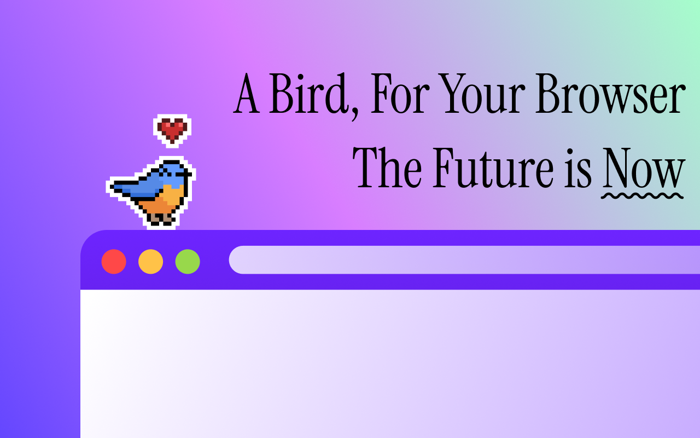

# Pocket Bird


[](https://chromewebstore.google.com/detail/pocket-bird/lbbdngkbbgaecefacpnhnhleggabghak)
[](https://addons.mozilla.org/en-US/firefox/addon/pocket-bird/)
[](https://discord.gg/6yxE9prcNc)



It's a pet bird that hops around your computer, what more could you want?

### Get it for [Google Chrome](https://chromewebstore.google.com/detail/pocket-bird/lbbdngkbbgaecefacpnhnhleggabghak) 

### Get it for [Mozilla Firefox](https://addons.mozilla.org/en-US/firefox/addon/pocket-bird/)

### Get it for [Obsidian (beta)](https://github.com/IdreesInc/Pocket-Bird#Obsidian)

### Get it for [TamperMonkey](https://github.com/IdreesInc/Pocket-Bird#Userscript)

#### Join the [Discord](https://discord.gg/6yxE9prcNc) to help me beta test new features and suggest ideas!

## Features

- A cute little pixel art bird hops around your apps and websites
- Collect rare falling feathers to unlock over 10+ different species of birds
- Add sticky notes that stay on the page even after you refresh
- And most importantly, you can pet the bird!

## Adoption Guide

### Google Chrome + Microsoft Edge

1. Go to the [Chrome Web Store page](https://chromewebstore.google.com/detail/pocket-bird/lbbdngkbbgaecefacpnhnhleggabghak)
2. Click "Add to Chrome" (or "Add to Edge" if using Microsoft Edge)
3. Confirm any permission prompts that appear

### Mozilla Firefox
1. Go to the [Mozilla Add-ons page](https://addons.mozilla.org/en-US/firefox/addon/pocket-bird/)
2. Click "Add to Firefox"
3. Confirm any permission prompts that appear

### Obsidian

1. Install the [Beta Plugin Manager (BRAT)](https://obsidian.md/plugins?id=obsidian42-brat) plugin for Obsidian
2. Enable the BRAT plugin and open its settings
3. In the BRAT settings, click "Add Beta Plugin" and enter the following URL: `https://github.com/IdreesInc/PB-Obsidian-Releases`
4. Select "Latest version" and click "Add Plugin"
5. Enjoy a pet bird in your Obsidian notes!

### Userscript

*Note that this is mainly used for beta testing new features, installation via browser extension is recommended for the best experience.*

1. Install [Tampermonkey](https://www.tampermonkey.net/) on your web browser
2. Enable the Tampermonkey extension and give it the permissions requested
3. Install my Pocket Bird script by going to this link and clicking install: [https://github.com/IdreesInc/Pocket-Bird/raw/refs/heads/main/dist/userscript/birb.user.js](https://github.com/IdreesInc/Pocket-Bird/raw/refs/heads/main/dist/userscript/birb.user.js)
4. Now any websites you visit will have a little bird hopping around!

### Your Own Website

Pocket Bird can also be embedded directly into your own website! Just include the following code snippet anywhere in your HTML:

```html
<script src="https://cdn.jsdelivr.net/gh/IdreesInc/Pocket-Bird@main/dist/web/birb.embed.js"></script>
```

## FAQ

### How do I pet the bird?

Simply move your cursor back and forth over your bird until a heart appears! You can also click the bird to open the menu and pet it from there. There may even be a slightly greater chance of finding a feather when your bird is well loved...

### How do I collect feathers?

Feathers will occasionally fall from the top of your window. Clicking on a feather will add a new species to your field guide, allowing you to change the appearance of your pet!

### How do I change my bird's appearance?

Once you've unlocked new species by collecting feathers, you can change your bird's appearance by opening the Pocket Bird menu (via clicking the bird) and selecting "Field Guide".

### How do I add sticky notes?

Open the Pocket Bird menu by clicking the bird and select "Sticky Note". From there, you can add, edit, and delete notes that will stay on the page even after refreshing.

### How do I hide the bird?

Open the Pocket Bird menu by clicking the bird and select "Settings". From there, you can toggle the bird's visibility on and off temporarily on the current page.

### Why does Pocket Bird need permission to read and change my data on websites I visit?

If you are running Pocket bird on a browser, the extension needs these permissions in order to insert the bird and sticky notes into your webpages. Pocket Bird does not collect any of your data or browsing history and all data is stored locally on your device!

## Sites With Pocket Bird

Here are some websites where you can find Pocket Bird hopping around:

- [https://grepjason.sh](https://grepjason.sh)

*If you've added Pocket Bird to your website, let me know and I'll add it to this list!*


## Getting in Touch

If you'd like to get in touch, check out the [Discord](https://discord.gg/6yxE9prcNc) to suggest features, report bugs, and stay updated on development!

Also feel free to check out my other open-source projects like [Monocraft](https://github.com/IdreesInc/Monocraft), [PicoChat](https://github.com/IdreesInc/PicoChat), and more on [my website](https://idreesinc.com/)!
